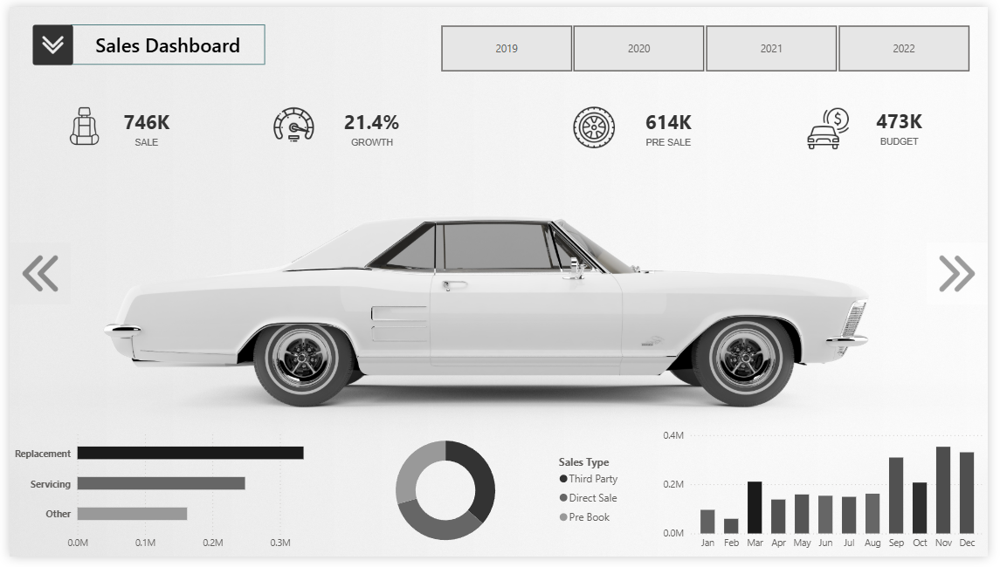
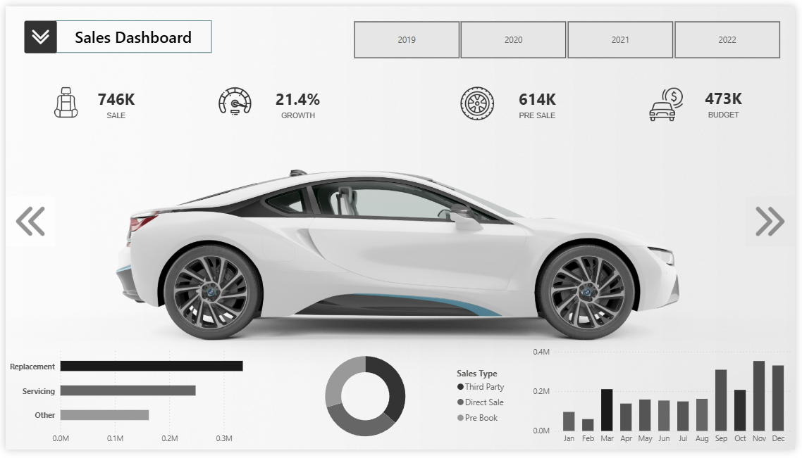
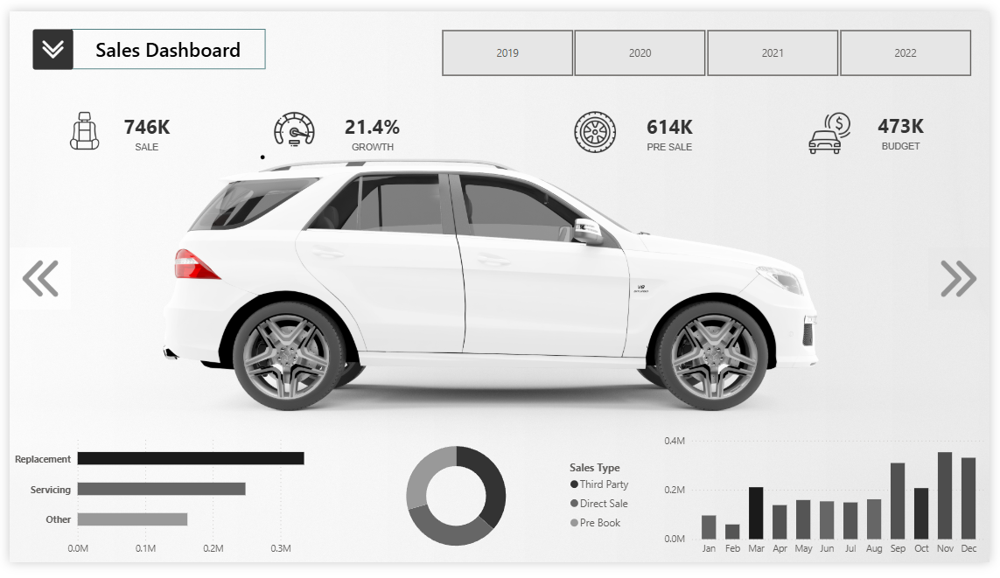

# Power BI Car Sales Dashboard

## Overview
This repository contains a Power BI dashboard designed to visualize car sales data. The dashboard tracks key metrics such as total sales, growth percentage, pre-sale figures, and budget across years (2019-2022). It features interactive elements like year tabs, sales type breakdowns (via pie chart), monthly trends (bar chart), and service categories (horizontal bar chart).

The dashboard includes dynamic car model images that change based on the selected model (e.g., Model1, Model2, Model3). It is enhanced with custom icons and background images for an attractive and professional interface.

This project showcases data visualization skills in Power BI, including:
- KPI cards for quick insights.
- Charts for trends and distributions.
- Themed visuals with automotive imagery.

## Repository Structure
- **`CarSalesDashboard.pbix`**: The main Power BI file. Open it in Power BI Desktop to explore or edit.
- **`Icons/`**: Folder containing custom icons used in the dashboard (e.g., for sales, growth, etc.).
- **`BackgroundImages/`**: Folder with background images for the dashboard theme.
- **`Model1.png`**: Screenshot of Model 1 view.
- **`Model2.png`**: Screenshot of Model 2 view.
- **`Model3.png`**: Screenshot of Model 3 view.

## Screenshots
Here are previews of the dashboard in different model views. These showcase the layout, metrics, and visualizations.

### Model 1

### Model 2

### Model 3

## How to Use
1. Download the `CarSalesDashboard.pbix` file.
2. Open it in Power BI Desktop (free download from Microsoft).
3. Interact with the tabs (2019-2022) and filters available in the dashboard.
4. To customize: Import your own data source or modify visuals in Edit mode.
5. Publish to Power BI Service for sharing (requires a Power BI account).

## Data Insights
- **Total Sales**: 746K units.
- **Growth**: 21.4% year-over-year.
- **Pre-Sale**: 614K units.
- **Budget**: 473K allocated.
- Sales peak in later months (e.g., Oct-Dec) based on the monthly bar chart.
- Replacement services dominate, followed by Servicing.

This dashboard is ideal for sales teams in the automotive industry. Feel free to fork and adapt!

## Contact
For questions or collaboration, reach out via GitHub issues.
